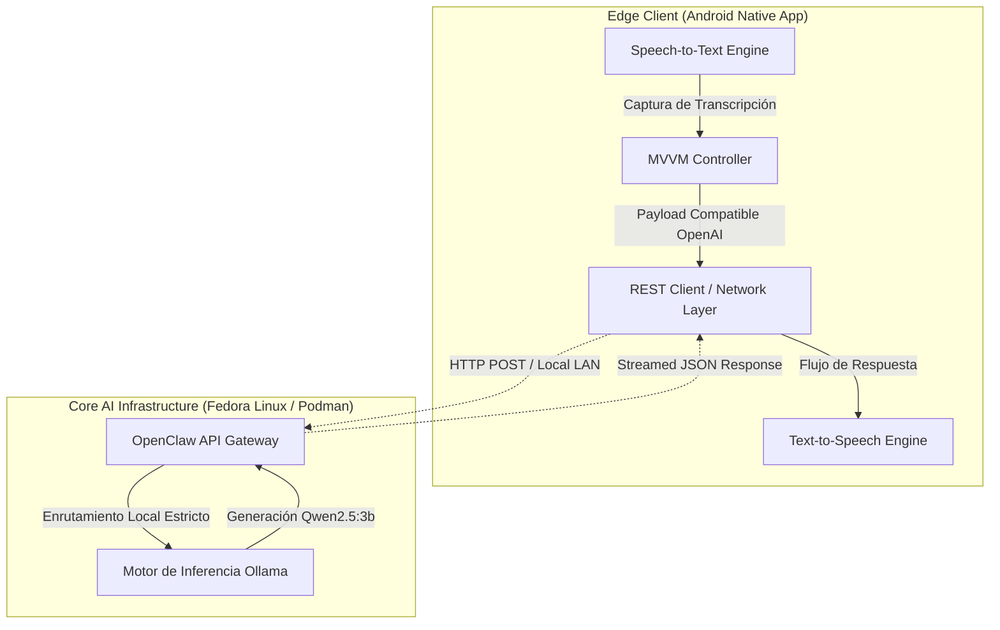

<div align="center">
  

  # 📱 AIVA — Enterprise AI Voice Assistant (Local-First)

  **Soberanía de Datos • Edge Inference • Arquitectura RAG Escalable**

  **AIVA** es un sistema de asistencia por voz de alto rendimiento, diseñado de forma nativa bajo un enfoque *Local-First* y *Zero-Trust*. Concebido para operar de manera autónoma sin dependencias de terceros en la nube, garantiza privacidad absoluta ("Data Sovereignty") y la menor latencia posible. La plataforma orquesta un cliente nativo en Android con un motor de inferencia de Inteligencia Artificial contenerizado, drásticamente optimizado para su despliegue en hardware de borde (Edge computing) con restricciones de VRAM.

</div>

---

## 🏗️ Arquitectura del Sistema

La topología del sistema implementa un potente modelo cliente-servidor desacoplado, aprovechando la aceleración local por hardware (**NVIDIA RTX 3050 6GB**) en el nodo core para mantener flujos conversacionales ininterrumpidos en tiempo real.



### ⚙️ Stack Tecnológico Core

| Dominio | Tecnología / Patrón de Diseño |
| :--- | :--- |
| **Cliente Móvil App** | Android SDK (Kotlin), Patrón MVVM + Clean Architecture |
| **Sistema Operativo & Virtualización** | Fedora Linux, Podman (Ejecución limpia, *daemonless*) |
| **Motor de LLM Core** | Ollama (Aceleración nativa integral vía NVIDIA CUDA) |
| **Proxy API / Gateway** | OpenClaw (Implementación adaptada de endpoints tipo OpenAI) |
| **Capa de Seguridad** | Custom `X.509 Trust Managers` para certificados locales *Self-Signed* |
| **Motor RAG Expert** | Framework Spring Boot Java, Spring AI, PostgreSQL (`pgvector`) |

---

## 🚀 Despliegue de Infraestructura (Servidor Backend)

Todo el ambiente backend ha sido encapsulado en contenedores asegurando un despliegue puramente declarativo, replicable e idempotente.

### 1. Nodo de Inferencia Cuantizado (Ollama)
Carga el ecosistema de inferencia asignando hardware de GPU en modo passthrough puro:
```bash
podman run -d \
  --name aiva-ollama \
  --device nvidia.com/gpu=all \
  -p 11434:11434 \
  -v ollama-data:/root/.ollama:Z \
  docker.io/ollama/ollama:latest
```

*Pre-descarga el modelo para el volcado directo a memoria VRAM sorteando validaciones en CPU:*
```bash
podman exec aiva-ollama ollama pull qwen2.5:3b
```

### 2. API Gateway & Controlador de Tráfico (OpenClaw)
Levanta el proxy inverso perimetral que ofusca las llamadas nativas gestionando el tráfico como endpoint estándar REST:
```bash
podman run -d --name aiva-gateway --network host \
  -e OLLAMA_API_KEY="ollama-local" \
  -v ~/openclaw_config:/home/node/.openclaw:Z \
  docker.io/alpine/openclaw:main
```
> [!IMPORTANT]  
> **Política de Seguridad Operacional:** Es estricto habilitar de forma explícita el endpoint `/v1/chat/completions` en la matriz de configuraciones de `openclaw.json`. Por diseño en OpenClaw, este túnel de acceso está restringido.

---

## 📱 Capa de Presentación (App Android)

El cliente de Android está diseñado como un *Thin Client* enfocado a la alta disponibilidad y reactividad, abstrayendo la pesada lógica del LLM utilizando *Clean Architecture*.

- **Control Granular de Telemetría:** Reclama permisos base absolutos para `RECORD_AUDIO` e `INTERNET`.
- **Enrutamiento Determinista (`AivaHttpClient.kt`):** Canaliza las llamadas a la infraestructura en malla (LAN):
  ```kotlin
  // Inyección de Endpoint Estático Centralizado
  private val HTTP_URL = "http://<IP_DEL_SERVIDOR>:18789/v1/chat/completions"
  ```
- **Auditoría Zero-Trust Local:** Uso intencional de un `X509TrustManager` modificado para aceptar transacciones TLS no firmadas por AC's públicas, mitigando rechazos SSL dentro del aislamiento LAN interno.

---

## 🧠 Motor RAG de Conocimiento Corporativo (Directorio `rag`)

Situado en el directorio [`rag`](./rag), este módulo sube el nivel de AIVA desde un simple interlocutor LLM hacia un **Sistema Experto Basado en Recuperación (Retrieval-Augmented Generation)** utilizando **Spring Boot** y el framework predictivo **Spring AI**.

**Highlights Arquitectónicos de MLOps & Data Engineering:**
- **Base de Datos Vectorial de Alto Rendimiento:** PostgreSQL + `pgvector` montado sobre Spring AI, facilitando indexación escalar multidimensional.
- **Recuperación Híbrida Inteligente (Hybrid Search):** Implementación predictiva que unifica Cosine Similarity (Vectores) y Keyword Search (Full-Text), equilibrando sus resultados matemáticamente con *Reciprocal Rank Fusion (RRF)* y Re-Ranking algorítmico.
- **Data Lineage Inmutable:** Ingesta en tiempo real con monitoreo `FileWatcher`. Validación criptográfica por Hash SHA-256 para aislamiento del conocimiento y bitácora física histórica en Blob Storage *Cold Retrieval*.
- **Prompt Lifecycle Tracking:** Sistema auditor local que maneja las versiones de *System Prompts* iterativamente (A/B Testing en Vivo), relacionando con base empírica las latencias de ejecución y la confiabilidad del modelo en el LLM local.
- **Guardrails Estrictos Bi-Direccionales:** Configuración estricta de "Context Steering". Previene Alucinaciones Críticas amurallando las derivas de texto hacia un forzado mapeo estructural legal (e.g. JSON puro para normativas SBS).
- **Observabilidad Nivel Producción:** Instrumentación total delegada a OpenTelemetry con inyección de *Spans* de latencia a token visualizados en *Arize Phoenix*; apoyado con pruebas masivas (Ground Truth) empaquetadas silenciosamente en un servidor *MLflow* local.

Para explorar toda la API orientada a eventos, pipelines de embeddings y despliegues, profundiza en su [Documentación Técnica (RAG API)](./rag/README.md).

---

## 🔧 Runbooks de Operación (Troubleshooting Técnico)

| Patrón de Falla | Análisis de Causa Raíz (RCA) & Resolución Automática |
| :--- | :--- |
| **Edge HTTP Error 404** | Error en capa Gateway perimetral. Refactoriza el `openclaw.json` encendiendo `endpoints.chatCompletions.enabled` a *true*. |
| **Inference Stalling / Latency Spike** | Falla de descarga VRAM (*Fallback* a CPU). Ejecuta `podman exec aiva-ollama ollama ps`; si el índice baja del `100% GPU`, purga y recarga el daemon de *NVIDIA Container Toolkit*. |
| **CLEARTEXT Protocol Rejected** | El OS perimetral denegó el tráfico HTTP en plano. Forzar omisión con `android:usesCleartextTraffic="true"` en la topografía directiva del `AndroidManifest.xml`. |
| **Hardware STT Error Code 7** | Pérdida de resolución de host subyacente. El servicio pasivo de accesibilidad Google SR o red colapsó impidiendo la captura temporal. |

---

## 🗺️ Roadmap Estratégico y Evolución Arquitectónica

- [ ] **Stateful Long-Term Memory:** Inyección heurística con técnica de *Sliding Window Context* para mantener flujos conversacionales coherentes sobre sesiones prolongadas sin penalidades agresivas de tokens.
- [ ] **Hotword / Wake-Word Edge Triggering:** Incorporar un micro-modelo Machine Learning ligero en el dispositivo para interceptación continua en segundo plano ("Hey Aiva").
- [ ] **Despliegue Multi-Agentic (Tool Calling):** Ampliar el pipeline de RAG para ejecutar disparos a funciones externas a demanda y manipulaciones del Sistema Operativo host.

---
<div align="center">
  <b>Ingeniería Estratégica y Desarrollo Core:</b> David Raymundo Lache Alvarez <br>
  <i>Proyecto de Portafolio — AI Systems Architecture & Mobile Engineering</i>
</div>
