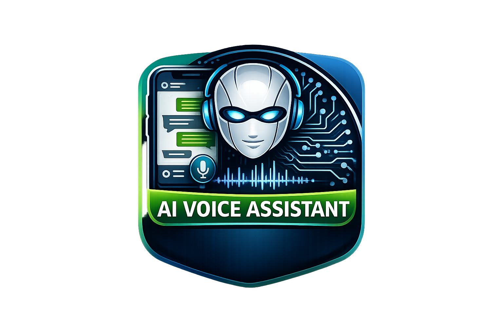

# 📱 Documentación Técnica — AIVA (AI Voice Assistant)

## 1. Descripción General

**Aiva** es una aplicación Android de asistente de voz que permite al usuario hablar en español (Perú), convierte la voz a texto, envía ese texto a un servidor de inteligencia artificial local (**OpenClaw** con el modelo `ollama/qwen2.5:3b`), recibe la respuesta y la reproduce en voz alta.

| Elemento | Valor |
|---|---|
| Plataforma | Android |
| Lenguaje | Kotlin |
| Min API | 26 (Android 8.0) |
| Target API | 36 |
| Arquitectura | MVVM + Clean Architecture (3 capas) |
| Servidor AI | OpenClaw Gateway |
| Modelo AI | `ollama/qwen2.5:3b` |
| Comunicación | HTTP POST (OpenAI-compatible) |
| Idioma de voz | Español (es-PE) |

---

## 2. Arquitectura

El proyecto sigue el patrón **MVVM** con 3 capas claramente separadas:

```
┌─────────────────────────────────────────────────────┐
│             PRESENTATION LAYER                      │
│  MainActivity.kt   ←→   MainViewModel.kt            │
│  (Vista / UI)             (Estado / Lógica UI)      │
└───────────────────────────┬─────────────────────────┘
                            │
┌───────────────────────────▼─────────────────────────┐
│               DATA LAYER                            │
│  ChatRepository.kt  (Mediador/Puente)               │
│                                                     │
│  network/AivaHttpClient.kt  (HTTP POST a OpenClaw)  │
│  device/TtsManager.kt       (Text-to-Speech)        │
│  device/SpeechRecognitionManager.kt (Micrófono)     │
└───────────────────────────┬─────────────────────────┘
                            │
┌───────────────────────────▼─────────────────────────┐
│               DOMAIN LAYER                          │
│  model/ChatMessage.kt  (Entidad de datos)           │
└─────────────────────────────────────────────────────┘
```

### Flujo de datos

```
Usuario habla → SpeechRecognitionManager → texto reconocido
→ MainViewModel.enviarMensaje() → ChatRepository.sendMessage()
→ AivaHttpClient (HTTP POST /v1/chat/completions)
→ OpenClaw Gateway → Ollama qwen2.5:3b
→ Respuesta JSON → AivaHttpClient → ChatRepository
→ MainViewModel → TtsManager.speak() → TTS en voz
```

---

## 3. Estructura de Archivos

```
app/src/main/
├── AndroidManifest.xml
├── res/
│   ├── drawable/
│   │   ├── bg_bubble_user.xml        ← Fondo burbuja usuario (morado)
│   │   └── bg_bubble_ai.xml          ← Fondo burbuja IA (gris oscuro)
│   ├── layout/
│   │   ├── activity_main.xml         ← Layout principal (chat)
│   │   ├── item_message_user.xml     ← Burbuja mensaje usuario
│   │   └── item_message_ai.xml       ← Burbuja mensaje IA
│   └── values/
│       └── themes.xml                ← Tema de la app
└── java/com/saamcito/aiva/
    ├── domain/
    │   └── model/
    │       └── ChatMessage.kt        ← Modelo de datos de red
    ├── data/
    │   ├── network/
    │   │   └── AivaHttpClient.kt     ← Cliente HTTP POST OpenClaw
    │   ├── device/
    │   │   ├── TtsManager.kt         ← Gestión TextToSpeech
    │   │   └── SpeechRecognitionManager.kt ← Gestión micrófono
    │   └── repository/
    │       └── ChatRepository.kt     ← Puente datos ↔ ViewModel
    └── presentation/
        ├── UiChatMessage.kt          ← Modelo UI de burbuja de chat
        ├── ChatAdapter.kt            ← Adapter RecyclerView
        ├── MainViewModel.kt          ← Estado UI + historial de mensajes
        └── MainActivity.kt           ← Actividad principal
```

---

## 4. Descripción de Cada Archivo

### 4.1 [AndroidManifest.xml](./app/src/main/AndroidManifest.xml)
Declara los permisos, configuración de red y punto de entrada de la app.

**Permisos requeridos:**
- `INTERNET` — para comunicarse con el servidor OpenClaw
- `RECORD_AUDIO` — para el micrófono

**Atributos clave en `<application>`:**
- `android:usesCleartextTraffic="true"` — permite tráfico HTTP (sin TLS) necesario para conectar al gateway local en el puerto 18789.

**Queries para reconocimiento de voz (Android 11+):**
```xml
<queries>
    <intent>
        <action android:name="android.speech.RecognitionService" />
    </intent>
</queries>
```

---

### 4.2 [themes.xml](./app/src/main/res/values/themes.xml)
Define el tema visual de la aplicación.

```xml
<style name="Theme.Aiva" parent="Theme.MaterialComponents.Light.NoActionBar"/>
```

> [!IMPORTANT]
> Debe heredar de `Theme.MaterialComponents` o `Theme.AppCompat` ya que [MainActivity](./app/src/main/java/com/saamcito/aiva/presentation/MainActivity.kt#22-75) extiende `AppCompatActivity`.

---

### 4.3 [activity_main.xml](./app/src/main/res/layout/activity_main.xml)
Interfaz de chat con fondo oscuro (`#0F0F1A`) usando `ConstraintLayout`:

| ID | Tipo | Descripción |
|---|---|---|
| `tvEstado` | TextView | Estado actual en la barra superior (escuchando, enviando, etc.) |
| `rvMessages` | RecyclerView | Historial de conversación con burbujas de chat |
| `tvRespuesta` | TextView | Hint en la barra inferior ("Presiona 🎙️ para hablar...") |
| `btnHablar` | FloatingActionButton | Botón de voz morado (#7C4DFF), fijo al fondo |

**Drawables de burbujas:**
- `bg_bubble_user.xml` — rectángulo morado, esquina inferior derecha plana
- `bg_bubble_ai.xml` — rectángulo gris oscuro, esquina superior izquierda plana

**Layouts de items:**
- `item_message_user.xml` — burbuja alineada a la **derecha** (usuario)
- `item_message_ai.xml` — burbuja alineada a la **izquierda** con 🤖 (IA)

---

### 4.4 [domain/model/ChatMessage.kt](./app/src/main/java/com/saamcito/aiva/domain/model/ChatMessage.kt)
Modelo simple para representar mensajes de chat.

```kotlin
data class ChatMessage(
    val type: String,    // tipo de mensaje (ej: "agent.reply")
    val text: String     // contenido del mensaje
)
```

---

### 4.5 [data/network/AivaHttpClient.kt](./app/src/main/java/com/saamcito/aiva/data/network/AivaHttpClient.kt)
Realiza peticiones **HTTP POST** al servidor OpenClaw.

**Configuración:**
```kotlin
private val HTTP_URL = "http://<IP_DEL_SERVIDOR>:18789/v1/chat/completions" // Reemplaza con la IP de tu servidor
private val TOKEN = "<YOUR_TOKEN>" // Reemplaza con tu token de openclaw.json
```

**Formato del request (compatible con OpenAI):**
```json
{
  "model": "ollama/qwen2.5:3b",
  "messages": [{ "role": "user", "content": "<texto del usuario>" }],
  "stream": false
}
```

**Headers enviados:**
- `Authorization: Bearer <token>`
- `Content-Type: application/json; charset=utf-8`

**Formato de respuesta esperado:**
```json
{
  "choices": [
    {
      "message": {
        "content": "<respuesta de la IA>"
      }
    }
  ]
}
```

**Errores devueltos (como strings):**
- `ERROR_HTTP|<código>|<cuerpo>` — error HTTP del servidor
- `ERROR_CONN|<mensaje>` — error de conexión de red

> [!NOTE]
> Se usa un `X509TrustManager` que acepta cualquier certificado, necesario para certificados autofirmados de entornos locales.

---

### 4.6 [data/device/TtsManager.kt](./app/src/main/java/com/saamcito/aiva/data/device/TtsManager.kt)
Gestiona la síntesis de voz (Text-to-Speech).

- **Idioma:** Español (Perú) `Locale("es", "PE")`
- **Método principal:** [speak(text: String)](./app/src/main/java/com/saamcito/aiva/data/device/TtsManager.kt#31-38) — reproduce el texto en voz alta
- **Ciclo de vida:** [shutdown()](./app/src/main/java/com/saamcito/aiva/data/device/TtsManager.kt#39-44) para liberar recursos

---

### 4.7 [data/device/SpeechRecognitionManager.kt](./app/src/main/java/com/saamcito/aiva/data/device/SpeechRecognitionManager.kt)
Gestiona el reconocimiento de voz (Speech-to-Text).

- **Idioma:** `es-PE` (Español Perú)
- **Método:** [startListening()](./app/src/main/java/com/saamcito/aiva/data/device/SpeechRecognitionManager.kt#44-52) — inicia el micrófono
- **Resultados:** expone `recognitionResults: SharedFlow<RecognitionResult>` con dos estados:
  - `RecognitionResult.Success(text)` — texto reconocido exitosamente
  - `RecognitionResult.Error(errorCode)` — código de error del sistema

---

### 4.8 [data/repository/ChatRepository.kt](./app/src/main/java/com/saamcito/aiva/data/repository/ChatRepository.kt)
Capa mediadora entre el [ViewModel](./app/src/main/java/com/saamcito/aiva/presentation/MainViewModel.kt#21-91) y [AivaHttpClient](./app/src/main/java/com/saamcito/aiva/data/network/AivaHttpClient.kt#17-88).

```kotlin
class ChatRepository(private val httpClient: AivaHttpClient) {
    suspend fun sendMessage(text: String): String? =
        httpClient.sendMessage(text)
}
```

---

### 4.9 [presentation/UiChatMessage.kt](./app/src/main/java/com/saamcito/aiva/presentation/UiChatMessage.kt)
Modelo de UI para cada burbuja de la conversación.

```kotlin
data class UiChatMessage(
    val sender: Sender,   // USER o AI
    val text: String,
    val timestamp: String // HH:mm
)
```

---

### 4.10 [presentation/ChatAdapter.kt](./app/src/main/java/com/saamcito/aiva/presentation/ChatAdapter.kt)
Adapter de `RecyclerView` con 2 tipos de vista (`TYPE_USER = 0`, `TYPE_AI = 1`). Infla `item_message_user.xml` o `item_message_ai.xml` según el remitente.

---

### 4.11 [presentation/MainViewModel.kt](./app/src/main/java/com/saamcito/aiva/presentation/MainViewModel.kt)
Núcleo de la lógica. Expone `uiState: StateFlow<MainUiState>` con el **historial completo de mensajes**.

```kotlin
data class MainUiState(
    val estadoTexto: String,
    val inputLabel: String,
    val isBotonHablarHabilitado: Boolean,
    val mensajes: List<UiChatMessage>,  // historial completo
    val scrollToBottom: Boolean
)
```

**Ciclo de estados:**
```
Inicio → "✅ Aiva lista"
Pulsar botón → "🎙️ Escuchando..."
Voz recibida → agrega UiChatMessage(USER) al historial
Esperando IA → "⏳ Enviando..."
Respuesta OK → agrega UiChatMessage(AI) + TTS habla
Error → agrega UiChatMessage(AI) con ⚠️ + detalle
```

---

### 4.12 [presentation/MainActivity.kt](./app/src/main/java/com/saamcito/aiva/presentation/MainActivity.kt)
Responsabilidades:
1. Inicializar `ViewModel`, `ChatAdapter` y `RecyclerView` con `stackFromEnd = true`
2. Solicitar permiso `RECORD_AUDIO`
3. Observar `uiState`: añadir mensajes nuevos al adapter y hacer `smoothScrollToPosition`
4. Pasar clics del FAB al ViewModel

---

## 5. Configuración del Servidor OpenClaw

### 5.1 Archivo de configuración: `openclaw.json`

Ubicación por defecto:
- **Linux/Mac:** `~/.openclaw/openclaw.json`
- **Windows:** `C:\Users\<usuario>\.openclaw\openclaw.json`

**Configuración relevante:**
```json
{
  "agents": {
    "defaults": {
      "model": {
        "primary": "ollama/qwen2.5:3b"
      }
    }
  },
  "gateway": {
    "port": 18789,
    "mode": "local",
    "bind": "lan",
    "auth": {
      "mode": "token",
      "token": "<YOUR_TOKEN>"
    },
    "http": {
      "endpoints": {
        "chatCompletions": {
          "enabled": true
        }
      }
    }
  }
}
```

> [!IMPORTANT]
> El bloque `"http.endpoints.chatCompletions.enabled": true` es **indispensable**. Sin él, el endpoint `/v1/chat/completions` retorna **404** porque está deshabilitado por defecto en OpenClaw por seguridad.

### 5.2 Puertos utilizados

| Puerto | Protocolo | Uso |
|---|---|---|
| `18789` | HTTP (sin TLS) | Gateway de API REST → `/v1/chat/completions` |
| `18790` | HTTPS / WSS | Interfaz Web de Control OpenClaw + WebSocket (no usado por la app) |

---

## 6. Dependencias ([app/build.gradle.kts](./app/build.gradle.kts))

| Librería | Versión | Uso |
|---|---|---|
| `okhttp3:okhttp` | 4.12.0 | Cliente HTTP POST |
| `kotlinx-coroutines-android` | 1.7.3 | Código asíncrono |
| `androidx.appcompat:appcompat` | 1.7.0 | `AppCompatActivity` + tema |
| `com.google.android.material:material` | 1.12.0 | `Theme.MaterialComponents` |
| `lifecycle-runtime-ktx` | 2.6.1 | `viewModelScope`, `lifecycleScope` |

---

## 7. Compilación e Instalación

### 7.1 Compilar el APK

```powershell
# Desde el directorio raíz del proyecto
.\gradlew.bat assembleDebug
```

APK generado en: [app\build\outputs\apk\debug\app-debug.apk](./app/build/outputs/apk/debug/app-debug.apk)

### 7.2 Instalar directamente en dispositivo (USB)

```powershell
.\gradlew.bat installDebug
```

### 7.3 Instalar manualmente (sin USB/adb)

```powershell
adb install -r app\build\outputs\apk\debug\app-debug.apk
```

---

## 8. Troubleshooting

| Error | Causa | Solución |
|---|---|---|
| App no abre / se cierra inmediatamente | `Theme.Aiva` heredaba de `android:Theme.Material` | Cambiar `themes.xml` a `Theme.MaterialComponents.Light.NoActionBar` |
| `ERROR_HTTP\|404` | Endpoint `/v1/chat/completions` deshabilitado en OpenClaw | Agregar `gateway.http.endpoints.chatCompletions.enabled: true` en `openclaw.json` y reiniciar |
| `ERROR_CONN\|unable to parse TLS packet header` | Puerto 18789 no usa TLS, se enviaba `https://` | Cambiar a `http://` en `AivaHttpClient.kt` |
| `ERROR_CONN\|CLEARTEXT communication not permitted` | Android 9+ bloquea HTTP plano por defecto | Agregar `android:usesCleartextTraffic="true"` en `AndroidManifest.xml` |
| La respuesta se corta / conexión caída | OkHttp timeout por defecto de 10s es muy corto para modelos locales | `readTimeout(120s)` ya configurado en `AivaHttpClient.kt`. Si persiste, aumentar. |
| `Error de voz: 7` | Sin conexión o Google Speech no disponible | Verificar conexión a internet en el celular |
| `adb: no devices found` | Celular sin USB o sin Depuración USB | Habilitar "Opciones de desarrollador" → "Depuración USB" |
