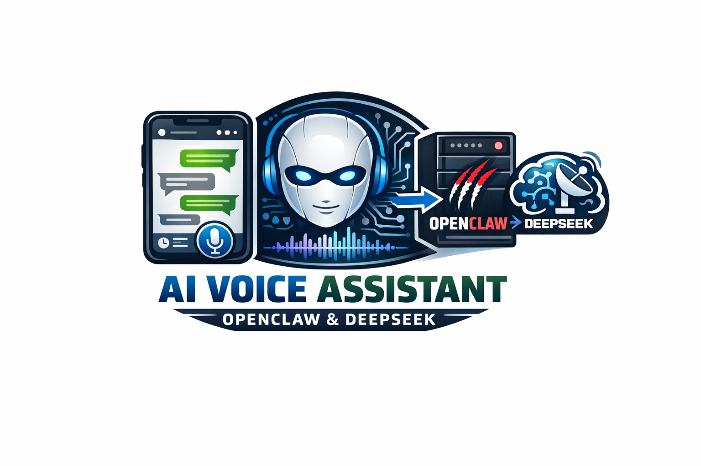

# Documentación de Instalación — OpenClaw + Ollama + DeepSeek/Qwen2.5
**Fedora Linux — Podman — RTX 3050**

---

# 1. Arquitectura del Sistema

El sistema implementa un asistente de voz local con los siguientes componentes:

| Componente | Puerto | Descripción |
|---|---|---|
| **Ollama** | 11434 | Servidor de modelos LLM local |
| **DeepSeek R1 / Qwen2.5:3b** | — | Modelos de lenguaje (100% GPU) |
| **OpenClaw** | 18789 | Gateway HTTP para comunicación con la App Android |
| **Open WebUI** | 3000 | Interfaz web para interactuar con los modelos |
| **Nginx** | 18790 | Reverse proxy HTTPS para acceso seguro desde la red local |

---

# 2. Requisitos Previos

- Fedora Linux con Podman instalado
- Driver NVIDIA instalado (probado con 580.126.18)
- GPU NVIDIA con soporte CUDA (probado con RTX 3050 6GB)
- Mínimo 8GB RAM, 16GB recomendado
- ~15GB espacio en disco para modelos

---

# 3. Instalación de Contenedores

## 3.1 Ollama (servidor de modelos)

```bash
podman run -d \
  --name ollama-server \
  --device nvidia.com/gpu=all \
  -p 11434:11434 \
  -v ollama:/root/.ollama \
  docker.io/ollama/ollama:latest
```

## 3.2 Open WebUI

```bash
podman run -d \
  --name open-webui \
  -p 3000:8080 \
  ghcr.io/open-webui/open-webui:main
```

Acceso: http://localhost:3000

## 3.3 OpenClaw

Primero crear los directorios de configuración:

```bash
mkdir -p /home/saamcito/openclaw_config/agents/main/agent
mkdir -p /home/saamcito/openclaw_config/workspace
mkdir -p /home/saamcito/openclaw_config/certs
```

```bash
podman run -d \
  --name openclaw \
  --network host \
  -e OLLAMA_API_KEY="ollama-local" \
  -v /home/saamcito/openclaw_config:/home/node/.openclaw:Z \
  docker.io/alpine/openclaw:main
```

---

# 4. Instalación de Modelos

## 4.1 Descargar modelo

Se recomienda **Qwen2.5:3b** para RTX 3050 de 6GB (cabe completo en VRAM):

```bash
podman exec ollama-server ollama pull qwen2.5:3b
```

## 4.2 Verificar uso de GPU

```bash
podman exec ollama-server ollama ps
```

La salida debe mostrar 100% GPU:

```
NAME          ID    SIZE    PROCESSOR    CONTEXT
qwen2.5:3b    ...   4.3 GB  100% GPU     32768
```

---

# 5. Archivos de Configuración

## 5.1 openclaw.json

Ubicación: `/home/saamcito/openclaw_config/openclaw.json`

```json
{
  "agents": {
    "defaults": {
      "model": { "primary": "ollama/qwen2.5:3b" },
      "models": { "ollama/qwen2.5:3b": {} },
      "workspace": "/home/node/.openclaw/workspace"
    }
  },
  "tools": { "profile": "coding" },
  "gateway": {
    "port": 18789,
    "mode": "local",
    "bind": "lan",
    "trustedProxies": ["127.0.0.1"],
    "auth": {
      "mode": "token",
      "token": "<YOUR_TOKEN>"
    },
    "tls": {
      "cert": "/home/node/.openclaw/certs/cert.pem",
      "key": "/home/node/.openclaw/certs/key.pem"
    },
    "controlUi": { "allowedOrigins": ["*"] }
  }
}
```

## 5.2 auth-profiles.json

Ubicación: `/home/saamcito/openclaw_config/agents/main/agent/auth-profiles.json`

```json
{
  "ollama": {
    "apiKey": "ollama-local",
    "baseUrl": "http://127.0.0.1:11434"
  }
}
```

---

# 6. Configuración HTTPS (Nginx Proxy)

## 6.1 Generar certificado autofirmado

```bash
openssl req -x509 -newkey rsa:4096 \
  -keyout /home/saamcito/openclaw_config/certs/key.pem \
  -out /home/saamcito/openclaw_config/certs/cert.pem \
  -days 365 -nodes \
  -subj "/CN=192.168.1.X" \
  -addext "subjectAltName=IP:192.168.1.X"

chown -R 1000:1000 /home/saamcito/openclaw_config/certs
```

## 6.2 Configuración de Nginx

Ubicación: `/home/saamcito/nginx.conf`

```nginx
server {
  listen 18790 ssl;
  ssl_certificate     /etc/nginx/certs/cert.pem;
  ssl_certificate_key /etc/nginx/certs/key.pem;
  location / {
    proxy_pass         http://127.0.0.1:18789;
    proxy_http_version 1.1;
    proxy_set_header   Upgrade $http_upgrade;
    proxy_set_header   Connection "upgrade";
    proxy_set_header   Host $host;
    proxy_set_header   X-Real-IP $remote_addr;
    proxy_set_header   X-Forwarded-For $proxy_add_x_forwarded_for;
  }
}
```

## 6.3 Levantar Nginx

```bash
podman run -d \
  --name nginx-proxy \
  --network host \
  -v /home/saamcito/openclaw_config/certs:/etc/nginx/certs:Z \
  -v /home/saamcito/nginx.conf:/etc/nginx/conf.d/openclaw.conf:Z \
  nginx:alpine
```

---

# 7. Acceso y Puertos

| Servicio | URL / Puerto |
|---|---|
| Open WebUI | http://localhost:3000 |
| OpenClaw (local) | http://localhost:18789/chat?session=main&token=\<TOKEN\> |
| OpenClaw (red) | https://192.168.1.X:18790/chat?session=main&token=\<TOKEN\> |
| Ollama API | http://localhost:11434 |
| App Android HTTP | http://192.168.1.X:18789 |

> [!CAUTION]
> Al acceder por HTTPS con certificado autofirmado, el navegador mostrará advertencia. Ir a **Avanzado → Continuar de todas formas**.

---

# 8. Integración App Android

La app Android se conecta a OpenClaw via HTTP POST para el flujo de asistente de voz:

1. **STT:** Android `SpeechRecognizer` captura la voz y convierte a texto
2. **Envío:** JSON via HTTP POST a `http://192.168.1.X:18789/v1/chat/completions`
3. **Procesamiento:** OpenClaw envía la consulta a Qwen2.5:3b via Ollama
4. **Respuesta:** OpenClaw devuelve la respuesta en JSON a la app
5. **TTS:** Android `TextToSpeech` reproduce la respuesta por la bocina

**Flujo de datos:**
```
App Android (STT) → OpenClaw (:18789) → Ollama (:11434) → Qwen2.5:3b → Respuesta → App Android (TTS)
```

> [!TIP]
> Librería recomendada: **OkHttp** para Android. El token de auth debe incluirse en el header `Authorization: Bearer <TOKEN>`.

---

# 9. Comandos de Gestión

## Ver estado de contenedores

```bash
podman ps -a
```

## Ver logs en tiempo real

```bash
podman logs -f openclaw
podman logs -f ollama-server
podman logs -f nginx-proxy
```

## Reiniciar servicios

```bash
podman restart openclaw
podman restart ollama-server
podman restart nginx-proxy
```

## Verificar uso de GPU

```bash
podman exec ollama-server nvidia-smi
podman exec ollama-server ollama ps
```

---

# ⚠️ Notas Importantes

> [!WARNING]
> El flag `--device nvidia.com/gpu=all` es crítico para que Ollama use la GPU. Sin él, el modelo corre en CPU y es muy lento.

> [!WARNING]
> La variable `OLLAMA_API_KEY="ollama-local"` es obligatoria. OpenClaw requiere que exista aunque Ollama no use autenticación real.

> [!WARNING]
> El `apiKey` debe ser exactamente `"ollama-local"`. OpenClaw lo usa como marcador interno para proveedores locales.

> [!NOTE]
> **DeepSeek R1:7b** y **Qwen2.5:7b** no caben completos en 6GB de VRAM y spillan al CPU (lentitud extrema). **Qwen2.5:3b** corre al 100% en GPU.
